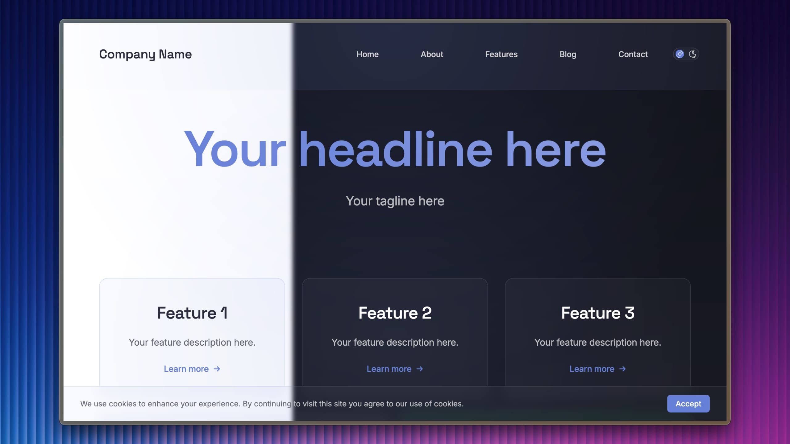

# Website Template by One Thirteen



A free, open-source, ready-to-use, website template built using HTML and CSS. [One Thirteen's website](https://onethirteen.co) was built using this template.

## Overview

This template provides a modern, responsive website foundation that you can easily customize for your own needs. It includes built-in features like dark/light mode, responsive navigation, and a blog system.

## Project Structure

```
/
├── index.html              # Main landing page
├── about/                  # About section
│   └── about.html         # About page
├── contact/               # Contact section
│   └── contact.html       # Contact page
├── features/              # Apps overview section
│   └── features.html      # Features page
├── open-source/           # Open source section
│   └── open-source.html   # Open source projects page
├── package.json           # Project configuration
├── .gitignore            # Git ignore rules
├── .gitattributes        # Git attributes
├── img/                  # Image assets
├── src/                  # Source files
│   ├── styles/          # CSS files
│   │   ├── main.css    # Main stylesheet
│   │   └── index.css   # Index page specific styles
│   ├── scripts/        # JavaScript files
│   └── components/     # Reusable components
└── repo/                # Repository assets
```

## Features

- **Responsive Design**: Fully responsive layout that works on all devices
- **Dark/Light Mode**: Built-in theme switching with system preference detection
- **Modern UI**: Clean, modern interface with smooth animations
- **Feature Showcases**: Template pages for showcasing multiple features or products
- **Blog Integration**: Built-in blog system with JSON-based content management
- **Optimized Code**: Dedicated CSS files for better organization and maintainability
- **Component-Based**: Modular structure with reusable components

## Technologies Used

- HTML5
- CSS3 (with CSS Variables for theming)
- JavaScript (Vanilla)
- Font Awesome Icons
- Google Fonts (Inter and Space Grotesk)

## Getting Started

1. Clone the repository:
   ```bash
   git clone https://github.com/onethirteenco/website-template.git
   ```

2. Navigate to the project directory:
   ```bash
   cd website-template
   ```

3. Open `index.html` in your web browser to view the template locally.

## Customization

The template is built with vanilla HTML, CSS, and JavaScript, making it easy to modify and extend. Key customization points include:

- Theme colors in CSS variables
- Content in HTML files
- Images in the `img` directory

## License

This template is provided under the MIT License. See the [LICENSE](LICENSE) file for the full license text.

## AI Disclosure

This README file was generated with the assistance of AI. The AI helped:
- Remove One Thirteen-specific language
- Restructure the content to be more appropriate for an open-source template
- Maintain technical accuracy while making the content more generic
- Format the documentation in a clear and organized manner